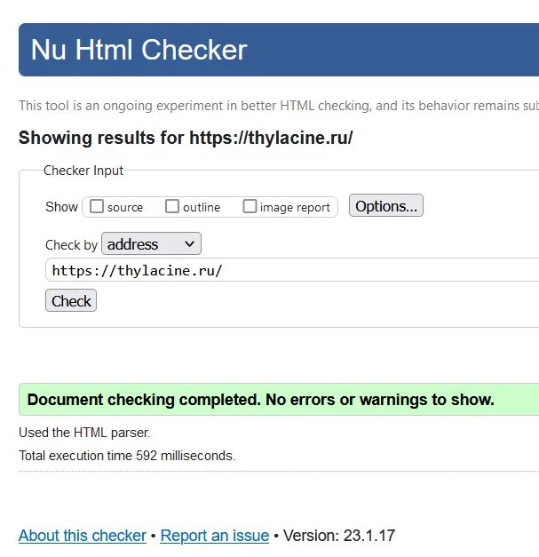
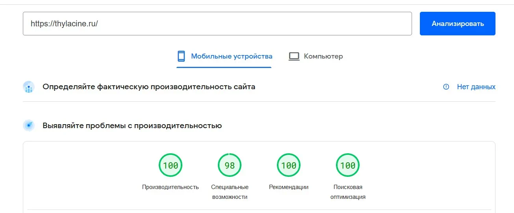

# Вёрстка landing page - Tzeezotje

## Демо страница:
[стартовая страница на сервере](https://thylacine.ru/) `https://thylacine.ru/`

## Валидация страницы



## Сервис тестирования PageSpeed Insights



## Версия Node  

* Node version v18.12.1

#### Установка зависимостей
```commandline
npm i
```

#### Режим разработки
```commandline
npm start
```
работает на: `http://localhost:8080/`


#### Production сборка
```commandline
npm run build
```

## Замечания по pixelperfect

* В кнопке [Reserve a table] и [Send] - разный размер шрифта, обычно всё должно быть единого стиля либо кнопка должна быть другой (выглядит как дизайнерская ошибка)

* В форме поля Name и Email имеют неправильный отступ, это видно относительно поля textarea который идёт на границе враппера (было принято решение привести всё к общему стилю).

* Список Contacts - поля имеют разные отступы между друг другом, что тоже является ошибкой.